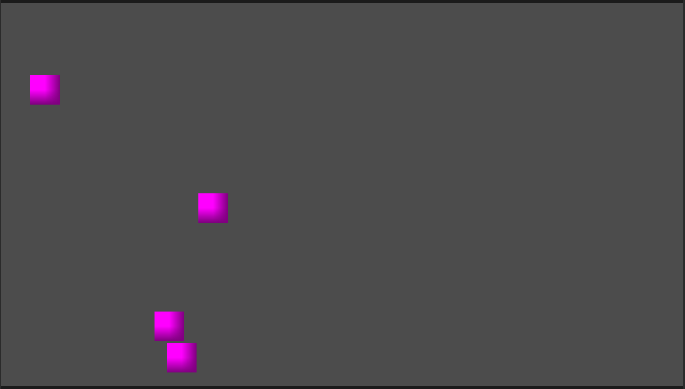
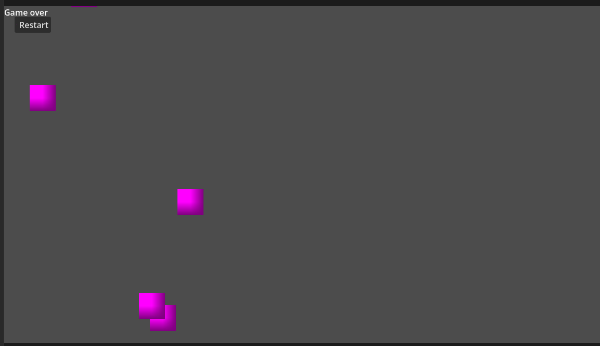

# 🎮 Dodge the Blocks

A simple 2D game made in **Godot Engine** where you dodge falling blocks for as long as possible.  
The longer you survive, the better your score!

---

## 🕹️ Gameplay

- Move left and right to avoid falling blocks
- Survive as long as you can
- Touching a block ends the game
- Restart and try to beat your high score

---

## 🎮 Controls

| Action | Key |
|------|-----|
| Move Left | ⬅️ Arrow / A |
| Move Right | ➡️ Arrow / D |
| Restart | Button / Enter (if enabled) |

---

## 💥 Features

- Player movement with physics
- Random falling block spawner
- Collision detection
- Game Over system
- Restart system
- Simple UI (Game Over screen)

---

## 🧱 Built With

- Godot Engine 4.x
- GDScript

---

## 📂 Project Structure

DodgeBlocks/
├── Main.tscn # Main game scene
├── Player.tscn # Player character
├── Block.tscn # Falling obstacles
├── GameOverUI.tscn # Game over screen
├── scripts/ # Game logic scripts
└── assets/ # Sprites / textures

---

## 🚀 How to Run

1. Download or clone the repo
2. Open Godot Engine
3. Click **Import**
4. Select the `project.godot` file
5. Press **Play ▶**

---

## 🎯 Goal

Survive as long as possible without getting hit by falling blocks.

---

## 🔥 Future Improvements

- Score system
- Increasing difficulty over time
- Sound effects
- Main menu screen
- Mobile touch controls

---

## 📸 Gameplay

## 💀 Game Over Screen

## 👨‍💻 Author

Made as a learning project using Godot Engine.